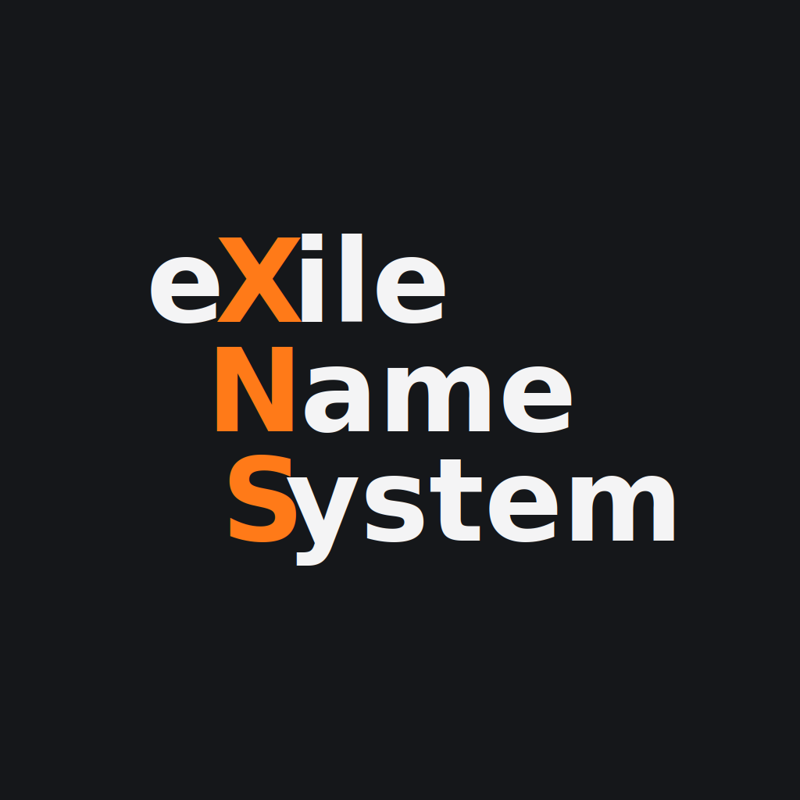

<div align="center">
  <a href="https://xns.rocks">
    
  </a>

  [Website](https://xns.rocks) ·
  [Documentation](https://xns.rocks/docs) ·
  [indeXer](https://indexer.xns.rocks) ·
  [Donate](https://xns.rocks/donate)
</div>

## XNS

XNS is the eXile Name System, the name system for the exile. Built on Monero,
it is uncensorable, unstoppable, unsquattable and unseizable.

It is the alternative to DNS and other name systems for the free men. Unlike
other alternatives, XNS does not invent yet another blockchain, token or
consensus. It is purely built on Monero and makes it the only source of truth.

## Repository

This is the canonical Go implementation of XNS. It builds a single `xns`
binary with three commands:

- `xns claim` claims or renews a name.
- `xns indexer` reconstructs the registry and serves the lookup API.
- `xns lookup` resolves a name through an indeXer.

The protocol implementation is also available as Go packages under `pkg/`.
Protocol details and complete usage guides belong in the
[documentation](https://xns.rocks/docs).

## Build

XNS requires Go and `monero-wallet-rpc`.

```sh
git clone https://github.com/exilens/xns
cd xns
go build -o xns ./cmd/xns
```

## Run

Claim or renew a name:

```sh
./xns claim \
  --mainnet \
  --wallet-file <wallet-file> \
  --wallet-password <wallet-password> \
  --name <name> \
  --owner <64-hex-ed25519-public-key> \
  --node <monero-node-url> \
  --years <years>
```

Run an indeXer:

```sh
./xns indexer \
  --mainnet \
  --node <monero-node-url> \
  --listen <listen-address> \
  --data-dir <data-directory>
```

Resolve a name:

```sh
./xns lookup \
  --indexer <xns-indexer-url> \
  <name>
```

Use `--stagenet` instead of `--mainnet` when operating on stagenet.
